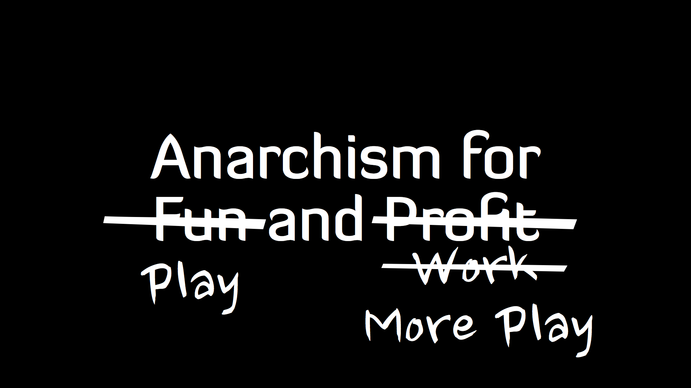
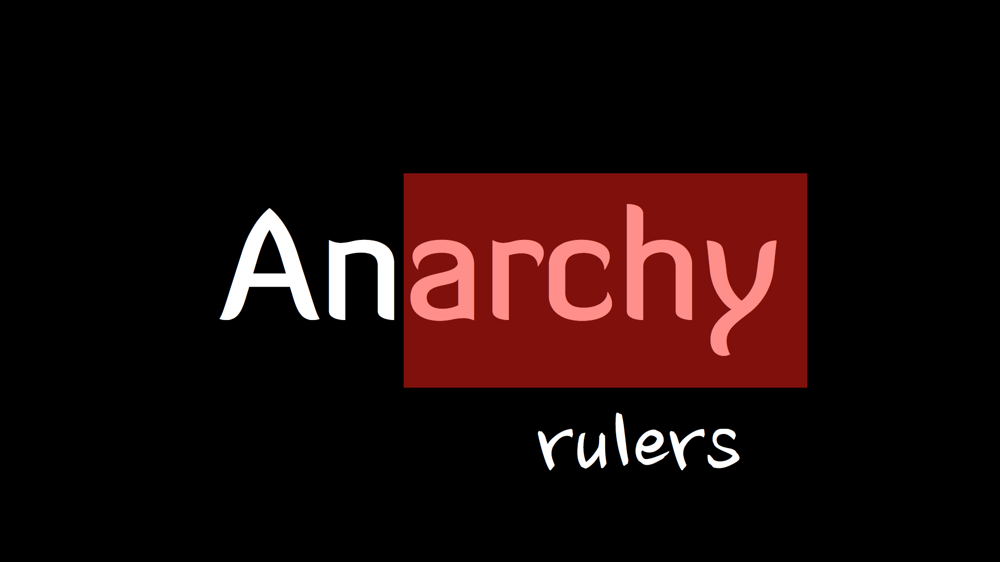
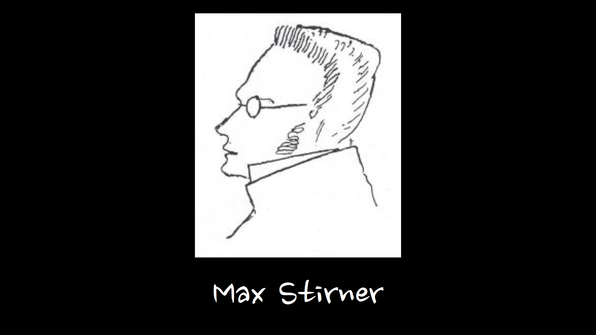
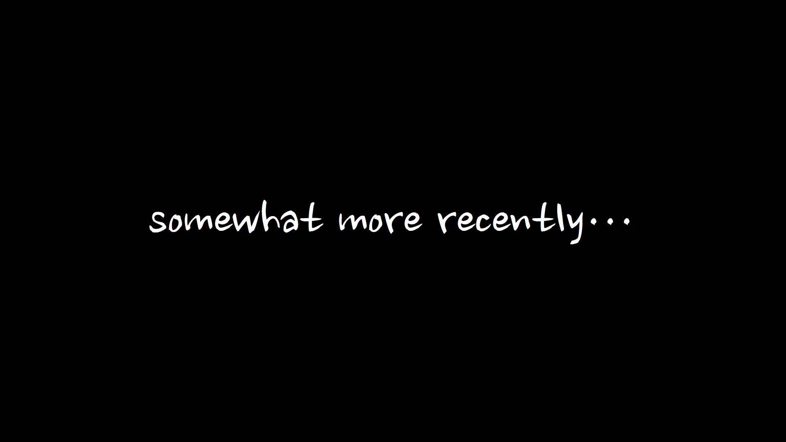
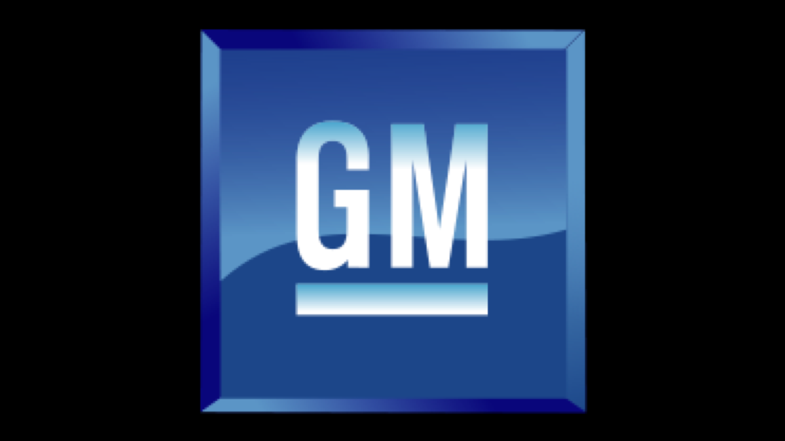
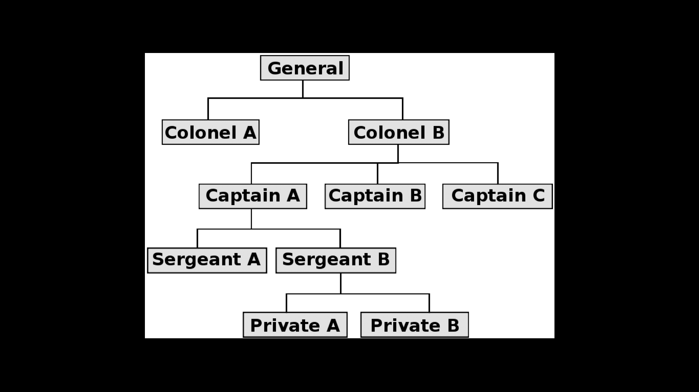
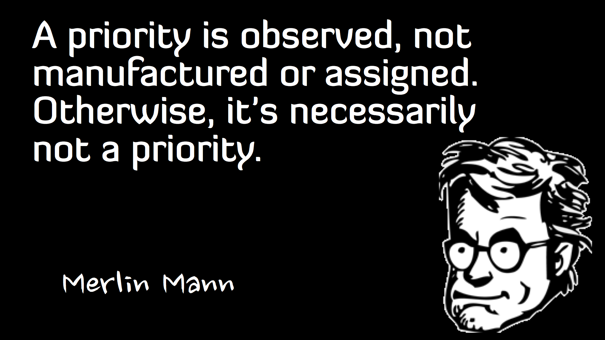
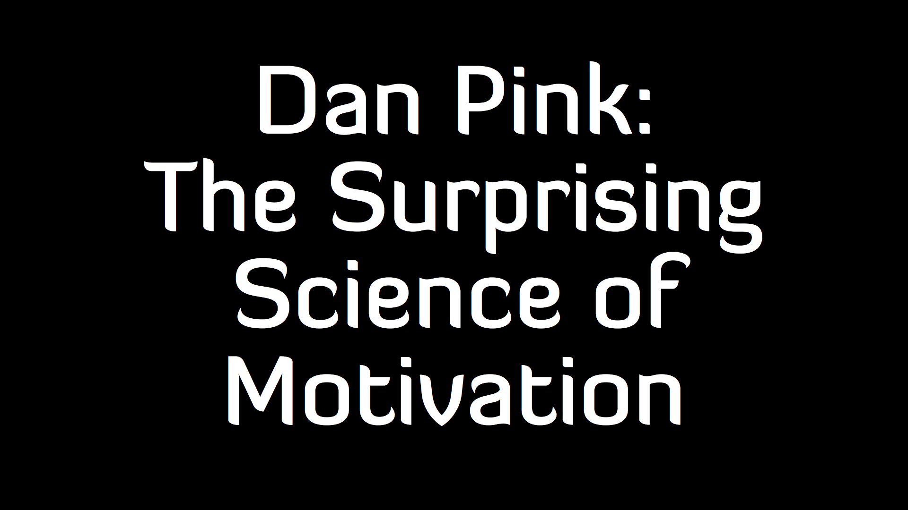

Here are the slides from my <a href="http://tacoconf.com/">TacoConf</a> talk on &ldquo;Anarchism for Fun and Profit&rdquo;.

Click on each image to go to the next one, or just scroll down leisurely.  If you prefer, you can get this <a href="http://dl.dropbox.com/u/3685/presentations/anarchy/anarchy-tacoconf.pdf">as a pdf</a> or <a href="http://dl.dropbox.com/u/3685/presentations/anarchy/anarchy-tacoconf.key">keynote</a>.

As is so often the case, a lot of great ideas and concepts were left out to make the story seem more straightforward, and to keep it in the time allotted.  I attribute a lot of things to Drucker that were actually developed by a lot of people at the time, and cut out this whole section about Walt Disney, and several other anarchist thinkers.  Max Stirner was just one of several relevant continental philosophers on the topic, etc.

Think of this work as a tease, and let it motivate you to go out and learn more.

I&rsquo;m here today to talk to you all about Anarchism for fun and profit.  Usually, the way we use these words, what we really mean is:

play and work.  and as I&rsquo;ll hopefully convince you by the end of this, what we typically think of as play or relaxation is just a brief recovery from what we call &ldquo;work&rdquo; which is actually bullshit.

This is what we ought to be doing.

So, I&rsquo;m gonna give you a little bit of history, mostly to put these ideas into context.  Then, I want to talk about how this applies to work, and some things I&rsquo;ve observed in the world of software development.

Let&rsquo;s start at the beginning.

&ldquo;Anarchy&rdquo; what does that actually mean?  It&rsquo;s not just a slogan for punk bands, but it&rsquo;s also a pretty broad topic.  The definition is right in the word:

&ldquo;An&rdquo; meaning &ldquo;no&rdquo; or &ldquo;without&rdquo;

&ldquo;Archy&rdquo; meaning ruler.

So, anarchy is the lack of rulers, hierarchies, and so on.

So, who runs things?

Basically, we all do

Of course, there are degrees of things.  But typically, anarchy implies that associations are voluntary rather than forced, and that each person has control over themselves rather than being controlled by someone else.

A lot of this goes back to a guy named Max Stirner.  Well, actually named Johan Schmidt.  He wrote a book called &ldquo;The Ego and Its Own&rdquo;.

One thing that strikes me about Stirner was how similar his lifestyle is to some of ours.  They had this philosophy discussion group back in the mid-19th century in a wine bar in Berlin.

Karl Marx sat in on a few of their sessions, Bruno Bauer, Friedrich Engels, and a bunch of other names you&rsquo;ve heard of if you got a liberal arts education.

I don&rsquo;t think they biked around eating tacos, and they probably didn&rsquo;t write JavaScript in coffee shops, but the similarities to the Oakland tech scene are nonetheless pretty striking.

In this book, he said that the individual is consumed and overwhelmed by ghosts and illusions.  In order to attain Right Action, these ghosts must be left behind.

Here&rsquo;s a quote that I think sums up what is so interesting about knowledge workers when they&rsquo;re really working at their best.

So, in other words, he wasn&rsquo;t writing because it was his job, he was writing because it&rsquo;s what he does.  He is a writer, and he can&rsquo;t find out the end of the story unless there&rsquo;s someone to tell it to.

In this passage, he&rsquo;s almost half-apologizing for inflicting the truth on society, because he fully expects it will incite revolutions; at the same time saying, &ldquo;Well, I need to find out the end, so&hellip; deal with it.&rdquo;

More in the modern age,

Bob Black is an American anarchist author, one of the most visible members of the &ldquo;primativist&rdquo; movement.  He&rsquo;s been criticized for being a &ldquo;lifestyle anarchist&rdquo; which is basically a fancy academic term for &ldquo;crazy person&rdquo;.

And, certainly, he&rsquo;s a little bit kooky.  But!  He wrote a really interesting essay, in his spectacularly bombastic style, called <a href="http://www.primitivism.com/abolition.htm">The Abolition of Work</a>.  If you aren&rsquo;t a fan of that style, there&rsquo;s an essay called <a href="http://www.zpub.com/notes/idle.html">In Praise of Idleness</a> by Bertrand Russell, which hits a lot of the same points, but is less confrontational.

He wrote this back in the 80s, and the central thesis of his whole ideology is that we work too much.  Back in the hunter gatherer days, he says, people actually didn&rsquo;t work nearly as much as they do today.

A lot of the work we do doesn&rsquo;t actually have to be done.  And a lot of the time we spend at work, we&rsquo;re not even really working, we&rsquo;re just sort of fucking around, hoping our boss doesn&rsquo;t see us fucking around, because in reality, humans can&rsquo;t be productive 100% of the time, and humans can basically <em>never</em> be productive doing something they hate.

A choice quote from his essay:

You should go read the essay.

So instead of being our best, and enjoying our time, and feeling happy, we get into this cycle of anxiety, guilt, and boredom.  Our tasks are boring, so we have a hard time focusing on them, so we don&rsquo;t get much done, and then we feel guilty, and are anxious that our bosses will find out and we&rsquo;ll be punished somehow.  This anxiety and boredom prevents us from <em>ever</em> achieving that glorious Csikszentmihalyi &ldquo;flow&rdquo; state where we have good ideas and feel great.

So, now that we&rsquo;ve covered the 19th century philosopher anarchists, and the modern day hipster anarchists, I want to switch gears and get a bit more serious here.

How do we make work not sucky?

You really can&rsquo;t talk about working and management in the modern era without mentioning this guy, Peter Drucker.  It&rsquo;s really rare to look back at someone from a few decades ago, who was writing about the future, and just go, &ldquo;Yeah&hellip; he was right.  Dude totally called it.&rdquo;

He was born in Vienna, and grew up sort of just all over Europe in the years after WW1, eventually moving to the US in the 30s.  He was influenced at a early age by Keynes and other economists of that time, but he wrote that he was more interested in the behavior of <em>people</em> rather than the movements of commodities, which is what economists usually focused on.

Viewed now, in light of the science of behavioral economics, it&rsquo;s clear he was really on to something.  Tversky and Kahneman really went on to define that field, but I don&rsquo;t have time to talk about them.  His career basically took off with the work he did at GM.

CONCEPT OF THE CORPORATION

GM, the car company.  Drucker was fascinated with the concept of authority, and really believed that making the world a better place would have to be done by the managers running companies, since they held so much power over so many people.

GM hired Drucker to do an extensive analysis of their organization, and from 1943 to 1946, he did just that, resulting in a book called &ldquo;Concept of the Corporation&rdquo; which detailed the structure and politics of General Motors, and also delved into its effects on society at large, from the point of view of the political machinations and teams within the organization.

See, up until then, management literature usually focused on a very top-down model.

The idea is that you have a leader, and he has some subordinates.  You tell your subordinates what to do, and they do it, possibly by delegating parts of their tasks to their subordinates, and so on.  So, the question was, how do we draw this tree so that it is the most effective, and how do we deliver orders that will be followed effectively?

It&rsquo;s a nice simple model, and it&rsquo;s probably how most people would go about explaining &ldquo;The Organization&rdquo; to someone who wasn&rsquo;t part of it.

But Drucker&rsquo;s approach was completely different.  He did investigate and explain how GM was organized, and praised them heavily for what was definitely a very scientific approach to developing management techniques and structures.

However, he also showed in this book that this hierarchy is only the tip of the ice berg of what actually happens.  In actuality, those captains (or directors, or whatever) talk to one another, and also talk to the sergeants and privates in other departments, and so on.

He noticed that there was all this cross-department interaction, and that the political hierarchy actually got in the way.  He suggested taking advantage of this, by structuring the company more like this:

A less hierarchical organization structure, where each business unit would be run more like a separate company with its own autonomy, and the ability to freely communicate with other business units.

Well, that was not taken well at GM, and his book was banned at the company.  What&rsquo;s super interesting is that the Japanese car companies <em>did</em> follow Drucker&rsquo;s advice and restructure, and proceeded to take advantage of the benefits that Drucker predicted.

This was pretty early in his career.  Again and again, the theme runs through Drucker&rsquo;s work: Decentralize, push decisions to the edges of the organization, plan on changing direction when the environment changes (he called this &ldquo;planned abandonment&rdquo;)

What is most fascinating about Drucker, really his &ldquo;crystal ball&rdquo; moment, in 1959, in a book called &ldquo;the landmarks of tomorrow&rdquo;, he coined the term &ldquo;Knowledge Worker&rdquo;

THE LANDMARKS OF TOMORROW

Drucker predicted that the &ldquo;Blue collar&rdquo; worker would soon be a thing of the past.  Increases in mechanization would eventually increase the productivity of a single manual laborer to the point where we just don&rsquo;t need people doing that.

He also predicted that the manual labor that is still required would be outsourced to countries in the process of developing their infrastructures in the context of all this increased mechanization.

Society would increasingly rely on what he called &ldquo;Knowledge Work&rdquo;, or occupations where people think for a living.  Whereas the 20th century is characterized by an increase in efficiency of manual work, the 21st century would be dominated by those who can properly understand and leverage Knowledge Work.

Managing knowledge worker productivity is hard.

The biggest problems is that it&rsquo;s not even really clear what it is they&rsquo;re doing.  If you have a manual laborer, and his job is to make widgets, you can just count the widgets at the end of the day, and there you go.

But, somewhat by definition, a knowledge worker isn&rsquo;t making the same thing over and over again, and the means of production is not a machine, but their brain, so we have to define the task, and often defining the task improperly can change perceptions and inadvertently reduce productivity

Once upon a time, you&rsquo;d either go to school, or not, and then go to a company like GM or ALCOA, or whatever, that existed for as long as you could remember, and you&rsquo;d climb a nice little ladder, or stay at the bottom, and after 50 years or so, you&rsquo;d retire.

Well, with Knowledge Work, because it is unstable by its very nature, since the same knowledge doesn&rsquo;t <em>need</em> to be created repeatedly, many of us &ndash; in fact, <em>most</em> of us &ndash; will have careers that long outlast the companies we work for.  Or, if not, if it&rsquo;s a google or apple, something with some staying power, by the time your career is over, it&rsquo;ll be a whole different company, making different things in different ways, etc.

In fact, the industrial revolution had already started this wheel in motion.  The information revolution has just accelerated it to the point where we can actually watch it happen in real time.

I&rsquo;ve worked at a bunch of companies, even technology companies, that still seemed to be stuck in the last century, and didn&rsquo;t quite &ldquo;get&rdquo; what makes knowledge workers work.

I&rsquo;m sure there are a few people out there who just want to put in their 8 hours like Neitzsche&rsquo;s Last Man, &ldquo;earn a living and keep warm&rdquo;.  The rest of the knowledge workers are working to make their jobs obsolete.

Just as the 20th century was devoted to increasing the productivity of manual laborers to the point where a lot of manual labor simply didn&rsquo;t need to be done, today&rsquo;s technology is making a lot of inessential knowledge work go away.  Already, many tasks have been replaced by software.

As Drucker repeated again and again in his work, if you take away the autonomy of knowledge workers, you take away everything that makes them valuable.

Huge fan of this guy.  I think if I had to pick a favorite person I&rsquo;ve never met but hope I someday do, it&rsquo;d be Merlin Mann.

You may be familiar with him as the <a href="http://inboxzero.com/">Inbox Zero</a> guy, or <a href="http://43folders.com">43Folders</a> guy, or <a href="http://twitter.com/hotdogsladies">@hotdogsladies</a> on twitter, or a bunch of other things.  <a href="https://www.youtube.com/watch?v=QwRrpCWTiOY">Talk: Who moved my brain?</a>

Merlin Mann&rsquo;s history is somewhat interesting, and I think parallels the trajectory of a lot of reasonably successful modern-day knowledge workers.  He did some web stuff, moved to california, worked at a few companies, pretty much hated it, and then ended up finding a niche where he can do what he&rsquo;s really passionate about.

And that is basically to do podcasts and make dick jokes on the internet, but also he goes and talks to companies about how they&rsquo;re literally murdering the souls of their employees.

In a lot of ways, Merlin Mann reminds me of Peter Drucker, but instead of spending 3 years writing a book to piss off one company, he goes around and talks at companies that never <em>ever</em> invite him back.

A lot of his work focuses on being a better knowledge worker, but also basically behaving like grownups in organizations.

This is one of those things that&rsquo;s really easy to think you understand, but really hard to actually get, especially for managers.

Even in a lot of places where they&rsquo;re are ostensibly trying to empower teams, at some level, priorities are still being handed down to them by people who are under the impression that writing a date on a spreadsheet is some sort of contract with the universe.

What this ultimately comes down to is that there are a lot of little unreasonable assumptions and expectations we place on one another without even realizing it.

Managers can say, &ldquo;Yeah, check email less, reduce communication overhead, work at a sustainable pace, don&rsquo;t be interrupt driven&rdquo;, but then when you try to explain what this means: that your employees will only check their email once per day, meetings should have the minimum number of people in them, and so on, they laugh at you like you&rsquo;re a crazy person.

In my own life, I&rsquo;ve been unemployed a few times.  I&rsquo;ve been poor, though I was lucky enough to be educated and to have a great support network.  I&rsquo;ve worked for tech companies, and sold vacuum cleaners and other things, I&rsquo;ve answered phones.  Not having a job when I needed money was probably the most stressful time in my life.

But, for a few months in 2010, I didn&rsquo;t have a job, but I didn&rsquo;t actually need one.  I&rsquo;d worked at Yahoo for 4 years, and got sort of sick of it.  So, I planned out how long my money would last, and decided to see what would happen if I just didn&rsquo;t have an employer for a while.

I highly recommend knowledge workers do this, at least every few years.  I didn&rsquo;t even realize how burnt out I&rsquo;d become, and those few months of idleness, well,

it just doesn&rsquo;t really make much sense to call it &ldquo;idleness&rdquo;, since it was one of the most productive times of my life.

Why be productive when you don&rsquo;t have a job?

Of course, I don&rsquo;t want to make it seem like jobs are necessarily bad things.

A lot of times, a company gives you access and opportunity to do the things you&rsquo;re passionate about, and that&rsquo;s when it&rsquo;s awesome.

But what really struck me about that time was how I felt so much more motivated to work on node than I ever had felt on any project before.  And as I looked around the node community, it seemed really interesting to me in those early days that everyone was working their asses off, and loving it

I don&rsquo;t know if who first coined this term, but I&rsquo;ve sometimes referred to the Node.js ecosystem, and particularly the npm registry, as a &ldquo;mostly anarchic dictatorship&rdquo;.

That is, there&rsquo;s definitely leadership, but the leader&rsquo;s role is shrunken down to almost nothing.  Because we built a decent module system, and node provided APIs that were easy to extend, little fiefdoms and satellite projects spun up.

So, it&rsquo;s maybe not &ldquo;anarchy&rdquo; in the purest sense, but it&rsquo;s about as close as we can get.  Anyone has the opportunity to leave and do their own thing, and the leader&rsquo;s role is mostly just to help everyone out, not to tell them what to do.

The awesome thing about working on an open source project like Node is that it is an anarchy with one dictator who is really answerable to the rest of the community.  The leader doesn&rsquo;t have any control over a person&rsquo;s income, so if you want a person to work harder, well&hellip; you have to make it enticing.

This means that we have to plan for occasional outages, or for people losing interest randomly and disappearing.

The payoff, though, is that people actually have a sense of ownership of what they do, because they&rsquo;re endowed with a sense of agency, and that attracts more people to come help, and when they&rsquo;re done with whatever it was that was distracting them, they tend to come back.

<a href="http://www.youtube.com/watch?v=u6XAPnuFjJc">Dan Pink has a great talk on this</a>, where he goes through lots and lots of evidence and reproduced studies.  The more people feel like they&rsquo;re in control of what they do, the more than that they are connected via social ties, the more respect they are shown, the better and more creatively they can perform.

It&rsquo;s not about how many hours you spend in an office.  It&rsquo;s about what you get done, and how good it is.

A lot of times, I think teams tend to forget what their mission is.  Or, worse, they may not have ever had one.

It&rsquo;s definitely helpful sometimes to have meetings or estimate when things will be done.  Anarchy isn&rsquo;t &ldquo;everyone run in a different direction&rdquo; (or at least, that&rsquo;s not very useful or fun most of the time.)

But I&rsquo;ve worked on a lot of projects where I would have sworn that <em>my job</em> was to pull bullshit estimates out of my ass about ill-defined product features just so some managers could massage the bullshit numbers into bigger bullshit numbers and hand it off to some other manager.

Which really highlights the point that we need &ldquo;leaders, not managers&rdquo;

It&rsquo;s a pretty subtle distinction.  But, the verb &ldquo;lead&rdquo; really implies a much more active role, and an assumption that we are actually going somewhere.  &ldquo;Managing&rdquo; means we&rsquo;re just kinda keeping everything in place.

The person who is ostensibly in charge of a team of knowledge workers needs to be a person who takes on a lot of group-helping tasks, but also is intimately involved in the project.  Most of their job has to be to listen, not to tell.  Because knowledge work happens best when it&rsquo;s fun, and &gt; fun cannot be forced

fun cannot be forced.

People work better when they&rsquo;re having fun.  So, this means that you have to let them work on things they care about, help them find good things to work on, and mostly stay out of their way.

So, I&rsquo;m way over my time limit here I think, but if anyone wants to talk about any of this stuff, I&rsquo;ll be around.  Thanks!

