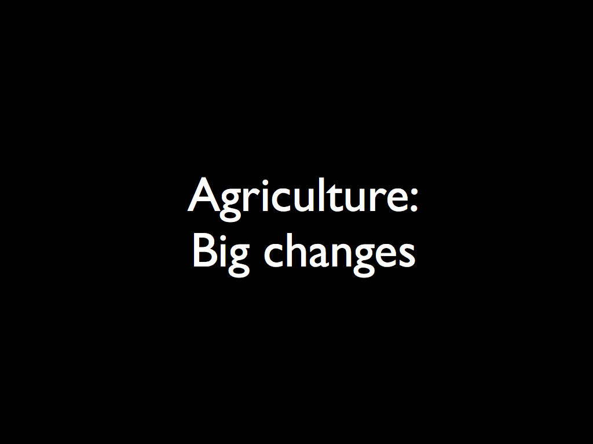
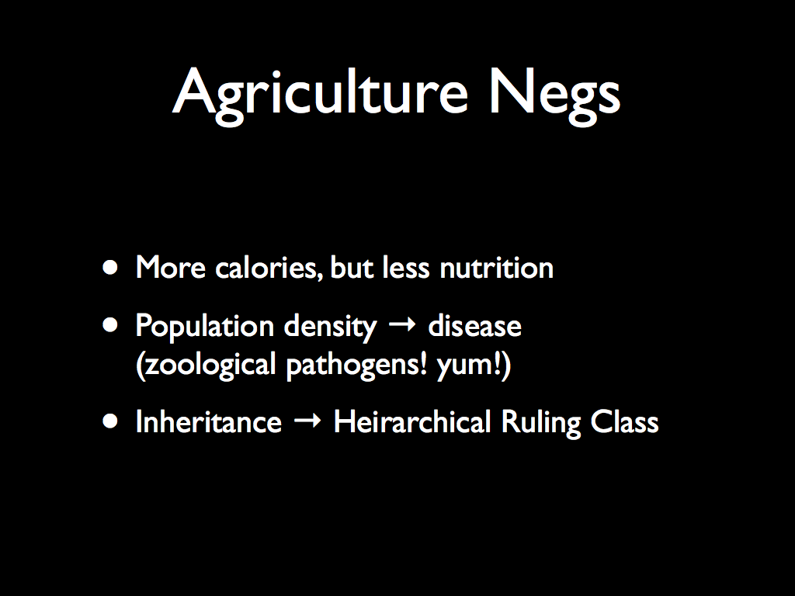
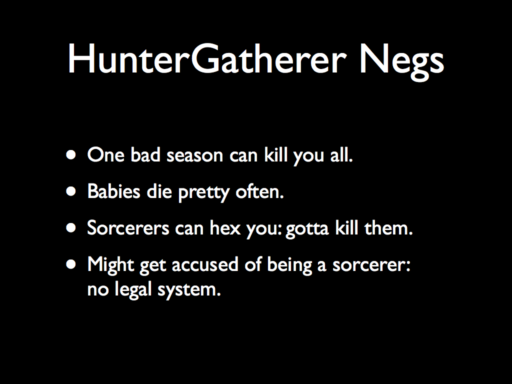
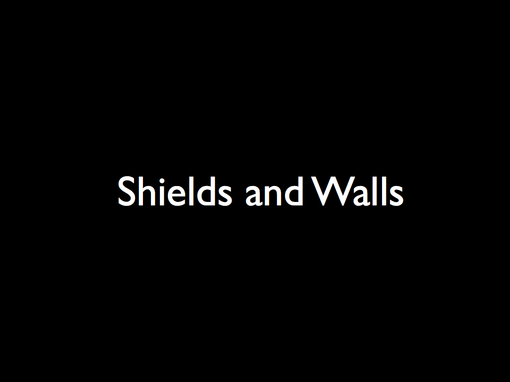
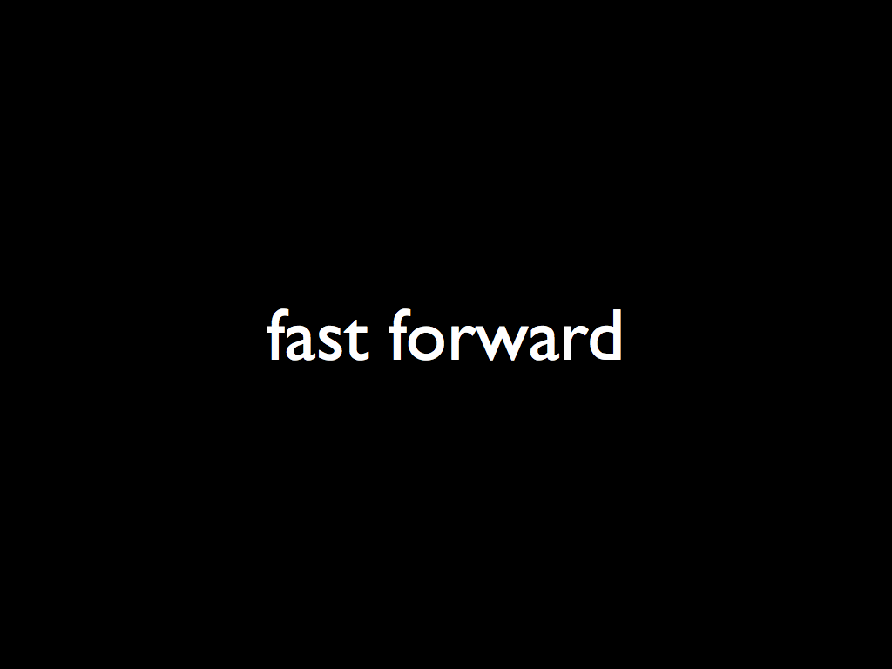
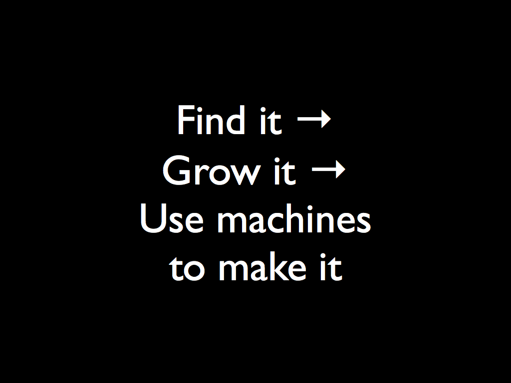
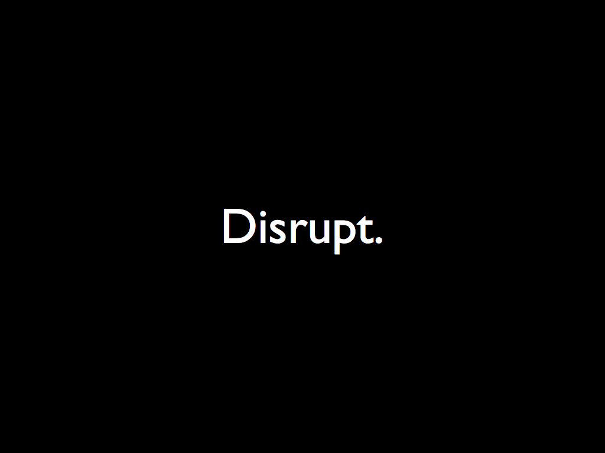

Here are the slides from the talk I just gave at <a href="http://www.nodedublin.com/">Node Dublin</a>.

Click each slide to advance to the next, or just scroll normally.

Hi.

So, first off, this is probably not the kind of talk you&rsquo;d usually see at a tech conference.  Maybe it should be.  I mean, we&rsquo;re all here because we have the technology in common, but I think the lesson of JSConf and NodeConf and the way that tech conferences have gone in the last few years in general is that these events are really about the community and node is not the typical tech community

and node is not the typical tech community.  I&rsquo;ve had the honor of being able to spend my days and nights working with this technology and the people who are passionate about it, and watch the community grow from basically just a handful of people up to the incredibly relevant thing it is today, and I believe that&rsquo;s going to continue.

I think it&rsquo;s going to continue because I think that one day, the node community will be typical of the technology communities we have

the node community will be typical of the technology communities we have.  This pattern will continue.

In the next 30 minutes or so, I&rsquo;d like to talk about some things that make the Node community so interesting, and why the patterns we&rsquo;re developing here are going to inevitably be copied, extended, and built upon.

It all comes down to human nature.

Because you see, software communities are made of people

software communities are made of people, of human beings.  And what are humans?

We&rsquo;re the most socially active of the great apes.

If you look at all the mammals, primates are some of the most social, and humans are the primates with the most interesting and complicated social interactions of any primates.  In fact, some anthropologists have made the case that human intelligence is really just there to support our incredible level of socializing.  In an evolutionary sense, our need for facebook made us smart enough to invent facebook.

I have always liked reading and learning about anthropology, because it&rsquo;s the study of what we are and where we came from, and really, everything we do, we do because humans do it, right?  Being a social primate means that we&rsquo;re obsessed with humans, which is why you&rsquo;re all listening to me yammer on like this.

So, our story starts a little while ago,

So, our story starts a little while ago

About 5 million years ago, give or take, lived the last common ancestor that&rsquo;s shared by the homo and pan genuses.  &ldquo;Homo&rdquo; as in &ldquo;homo sapiens&rdquo;, &ldquo;homo neanderthalus&rdquo;, etc. &ndash; humans, basically; and &ldquo;pan&rdquo; as in chimps and bonobos.  That&rsquo;s when we split off from one another

5 Million years is not a very long time, from an evolution point of view.  In fact, it&rsquo;s so recent, that some people have argued that pan and homo should really not be separate genuses, and we should rename chimps to &ldquo;homo trogolodytus&rdquo; and bonobos should be &ldquo;homo paniscus&rdquo;.

That is, we&rsquo;re so closely related that we&rsquo;re basically the third species of chimps along with those two, and have almost as much in common with them as they do with each other.  Their last common ancestor was only 1M years ago.  So, genetically speaking, they live in the same building, we live next door, and the other great apes are across town somewhere.

About a quarter million years ago, we find the first anatomically modern humans.  That is, if you went back in time a quarter of a million years, and plucked some homo sapiens that was walking around, and teleported them through your time machine to today, they&rsquo;d be just like you and me, minus a whole lot of technology, like JavaScript and iPhones and time machines.

Also, you&rsquo;d almost certainly see that they made their living, as it were, by looking for edible things in a forest; fruits, nuts, catching fish and insects, and hunting.  Until about 10,000 years ago, all humans had hunter-gatherer lifestyles, and a few societies today still do, but they&rsquo;re much more rare, and there&rsquo;s been a lot of interaction with them, so they&rsquo;re not entirely indicative of our early origins, but we can still get some insights by observing them and how they live.

The key component of hunter-gatherer or &ldquo;immediate return&rdquo; societies is that they have to keep moving, and are fiercely egalitarian.  What that means is, <em>everything</em> is shared.  Hunting is a group activity, and you don&rsquo;t always catch something.  If I don&rsquo;t share with you, then you don&rsquo;t share with me, and we all die.  Also, everything they have has to be continually packed up and carried to a new place, so there&rsquo;s really no &ldquo;ownership&rdquo; of anything.

But, this isn&rsquo;t just a big hippie love fest where we all share because we like each other; people who don&rsquo;t share are shunned, and in some cases killed.  In that kind of society, there&rsquo;s no room for selfishness, and so the group doesn&rsquo;t tolerate it.

So, if you looked at the whole time that humans have been on this planet, you&rsquo;d see that about 250 thousand years were spent wandering around, fishing, hunting, collecting bugs and nuts and fruits, and then, in the last 10,000 years, we suddenly stopped moving around, and started growing starchy plants.  We&rsquo;d already domesticated certain animals, so really the shift is from hunter-gatherers, to nomadic herders, to farmers.  But in evolutionary terms, the change was dramatic and swift, and mostly one-way.

And so, there was more food, and it was all in one place.  Clearly great, right?

So there was a lot of food, and it was all in one place.  So this was clearly great, right?

I mean, with a surplus of food, and the lack of any need to move around, you get societies growing very quickly, and other things show up as well:

So, with the advent of agriculture, you get all this great stuff.  Because we weren&rsquo;t moving around so much, you could keep more &ldquo;stuff&rdquo;.  Also, fewer babies died, so that&rsquo;s great of course.

And, since you had a surplus of food, you could trade it with other groups.  Trade meant that we needed a way to write stuff down, which led to writing down our stories that were previously only oral traditions, and this in general led to an explosion in the amount of technology, since each generation could more effectively build on what the previous generation had done.  However

However, not all was wonderful in early farming societies, and in fact, there were a lot of problems.

The first farming societies that we have records of, from Catal Huyuk and some other places, around 12,000 to 10,000 years ago, show people living basically right on top of one another.  They still had virtually no personal possessions.  However, these little &ldquo;mound cities&rdquo; grew really fast, and studies of the bones of the people who lived there showed that they starved less often than hunter-gatherers, but suffered from terrible malnutrition.  The average male height falls from about 200cm to about 160cm in the span of 10 generations or so, because being taller is a liability if you&rsquo;re not getting adequate nutrition.

Also, all those people living right on top of one another leads to an explosion in infectious diseases that were never much of a problem in the hunter-gatherer days.  Because we were living with our animals, you have zoological pathogens springing up, and so on.

I want to pause for a second here, and point out that being a hunter gatherer is not without it&rsquo;s faults, either.  While most of the places people lived had plenty of fruits and nuts and bugs and animals, if there was a bad season, you just went hungry, and sometimes that meant that everybody died.  Especially, kids died a lot, which is why you hear stuff like the average life expectancy being only 30 years old; people lived a long time, but the infant mortality brought the average way down.

Worst of all, there were sorcerers always casting hexes, and you gotta kill those fuckers, or else they might hex everybody.

Even worse, if anyone claims you&rsquo;re a sorcerer, you&rsquo;re pretty much fucked, because there&rsquo;s no legal system, and you&rsquo;re just a couple dozen folks out in the woods, so&hellip; yeah.  A legal system and science and that stuff, turns out those are pretty nice perks.

But most interestingly, I think, is that two things show up shortly after the advent of farming, which weren&rsquo;t present in Catal Huyuk and other very very early neolithic settlements: We started making shields and walls

But most interestingly, I think, is that two things show up shortly after the advent of farming, which weren&rsquo;t present in Catal Huyuk and other very very early neolithic settlements: We started making shields and walls

In the remains of hunter-gatherers, there&rsquo;s a lot of weaponry.  Really creative, gnarly looking things.  I mean, they had a lot of time to sit around, and no tv or anything, and their job was to try to kill shit, so they came up with these creative ways to do it.  You see these elaborate awesome spears, and bows and arrows, with flint arrow heads, and badass knives, and all sorts of other stuff.

But you don&rsquo;t see any <em>defensive</em> artifacts until the Neolithic period, and there aren&rsquo;t any fortifications.  Why is this important?

Well, you don&rsquo;t need a shield for <em>hunting</em>, because animals don&rsquo;t shoot back.  And there&rsquo;s no need for a wall if you don&rsquo;t need to protect something.  So, the advent of defenses shows us that humans started being offensive and violent with one another in a systematic way, just a short while after we started farming.

When I first learned this, it seemed really strange to me.  After all, now there&rsquo;s a surplus, why would that possibly make us want to fight?  You&rsquo;d think that people would be more likely to fight when there isn&rsquo;t enough to go around.

I wanna back up the evolutionary chain just a bit, and check out that other fork in the road.  The story starts in Africa.

Gombe, to be exact.

In 1960, Jane Goodall went into the jungle to study chimps in the wild.  We all pretty much take this for granted now, but at the time, very little was actually known about chimps.  Goodall spent some time traveling around in the jungle getting to know them.  She found them at that time to be &ldquo;rather more peaceable&rdquo; than human beings.  There were some scuffles and whatnot, especially between adolescent males, but for the most part, they all got along.  When one chimp found some food, they&rsquo;d even call out for others to come and share it.

So, for five years, Goodall traipsed around the jungle, and learned a lot.  Then, they wanted to get some more data, so they went back.

And there were two more expeditions.  This time, though, in order to get more time interacting with the chimps, rather than follow them around through the woods, they handed out bananas at specific times, so that the chimps would come to the researchers.

They found a very different sort of animal in these subsequent expeditions.  Whereas the chimps had previously been immediate-return foragers, now they could smell ripe fruit, but were unable to get to it or eat it.  They&rsquo;d tear the boxes to shreds, and the researchers had to keep getting stronger and stronger locks to hide the bait food.

What&rsquo;s more, the chimps started setting up patrols.  Groups of young males would circle the camp, and viciously attack any outsiders that tried to come near.  Previously, they&rsquo;d worked together with other groups, but with the advent of bait food, they became fiercely territorial and antagonistic. And there was cannibalism, rape, every kind of atrocity, which had never been seen before.

The takeaway from this, I think, is really interesting:

The takeaway from this, I think, is really interesting:

When our food is all in one place, we don&rsquo;t feel like we have to work together.  In fact, we feel like we have to keep other people <em>away</em> from it, and hoard it.  Rather than making everyone get along better, a surplus actually seems to make us behave <em>worse</em> towards one another.  We break up into teams, we get political and antagonistic, and generally anti-social.

The data from these expeditions came under fire for influencing the chimp behavior with the research methods.  So, they sent out some more expeditions to observe the same tribes of chimps, but in the original &ldquo;naturalistic&rdquo; method.  What do you think they found?

No change.  Their level of aggression and anxiety wasn&rsquo;t as high, because they didn&rsquo;t have the stressor of the bananas in boxes teasing them all the time, but the chimps in the area were much more antagonistic towards outsiders than Jane Goodall had seen in her first visits.

So, after the introduction of the bait food, they didn&rsquo;t go back to being nice.  The changes were cultural.  This is similar to how a domesticated animal will stay domesticated, even once you release it back into the wild.

In other words, for the last 10,000 years, ever since the neolithic revolution, we humans have been domesticated, and living in captivity.

Fast forwarding to the present day, let&rsquo;s look at the major revolutions that we&rsquo;ve gone through, as a species:

we went through immediate-return hunter-gatherers, to an agricultural society.  Next we had the industrial revolution, and I&rsquo;d argue that we&rsquo;re still in the midst of the information revolution.  And really, you can probably make the case that the industrial revolution and the information revolution are part of the same thing:

We went from finding our stuff, to growing our stuff, and the next step is using machines to do the work for us.  Our machines have gotten more and more interesting, and now we&rsquo;re at a point where we even use machines to communicate with one another and to think.

In order for something to be a revolution, it has to be disruptive.

In order for something to be a revolution, it has to be disruptive.

Truly disruptive technology doesn&rsquo;t just do something in a new way, it does something in such a way that the old ways of doing it no longer make sense, because the sort of scarcity that those techniques were designed around no longer exists.

After farming, the hunter-gatherer lifestyle was forever gone.  Now that we&rsquo;ve started down the road of the industrial revolution, we can&rsquo;t turn back, ever.

But in order for a disruption to happen, it has to tap into something fundamental in our nature, and come at the right time in history, when we&rsquo;re ready to accept it.

And disruption isn&rsquo;t always great at first.  In fact, the bigger the disruption, the more things it probably ruins.

We like to think of information technology as being disruptive, but I think we tend to overestimate how much of a revolution it&rsquo;s been, and underestimate how much revolutionizing is still to come.

The shift from being a peasant farmer working for a nobleman, to a cog in a corporate machine, is really not that big of a difference.  And today, a lot of IT still works this way.  You work for a company, and that company basically calls all the shots.

Until just the last few generations, the assumption for most people was that you&rsquo;d work for the same company for most of your life, and that the company would build walls around the value you create, and use the controlled scarcity to exert some power and influence and make a profit.  But what happens when someone comes along and notices that the scarcity is imaginary, or invents something that makes it no longer scarce?

I&rsquo;m certainly not the first to remark that knowledge work has the potential to be a bit different, and in fact, really HAS to be approached differently than the traditional industrial model. (<a href="http://blog.izs.me/post/23048895912/tacoconf-anarchism">Anarchism for Fun and Profit</a>, <a href="http://blip.tv/jsconfar/isaac_z_schlueter-6193181">Anarchy, Dictators, and Diplomacy: Leveraging Chaos in Open Source Communities</a>)

Search the internets for &ldquo;programmer anarchy&rdquo; or &ldquo;anarchy nodejs&rdquo; and you&rsquo;ll see a few other people talking about it, as well.  Definitely watch <a href="http://www.infoq.com/presentations/Leaner-Programmer-Anarchy">Fred George&rsquo;s talk about Leaner Programmer Anarchy</a>, it&rsquo;s one of the best I&rsquo;ve seen on the subject, with some fascinating before-and-after data showing how un-agile typical &ldquo;agile&rdquo; really is.

The basic thesis of this point is that, the more freedom you give to your knowledge workers, the more they end up accomplishing.  Strict hierarchies do provide some useful features, but they&rsquo;re a net loss in terms of overall productivity.  Practically by definition, programmers &ndash; and all knowledge workers, really &ndash; are heading into the unknown, and know more about it than their bosses, so why not just get rid of the whole concept of &ldquo;boss&rdquo; and &ldquo;employee&rdquo;, and let them do whatever they want?

But this still assumes that we have a &ldquo;company&rdquo; owning and driving things.

And certainly, a lot of open source projects have, to some degree, a company behind them.  Node is backed by Joyent, for example, and they own the name and the logo, etc.

However, a lot of open source projects are managed in a somewhat weird way.  <a href="http://smartos.org/2012/07/27/corporate-open-source-anti-patterns-doing-it-wrong/">Bryan Cantrill did a talk at FISL called &ldquo;Corporate Open Source Anti-Patterns&rdquo;</a>, that I highly recommend you check out.  It&rsquo;s as if a lot of companies have heard that open source is great, and that communities can do a lot for your technology, but then proceed to do everything in their power to cripple and destroy the community around it.

It&rsquo;s very difficult for most corporate cultures to come to grips with the idea that we actually get much more out of a technology community when we break down the walls, and give away as much as possible.

Also, what I don&rsquo;t think that many people really realize about Node is that, it&rsquo;s not just a Joyent project.  In fact, most of the people working on it, don&rsquo;t work at Joyent.  And, most of the value of Node is not in the node core project itself, but in the thousands of other modules people are creating and publishing in the npm registry.

Of course, nothing about Node is really new.  Async IO is as old as the hills, and there&rsquo;ve been plenty of other module systems and so on.  Node is an example of a lot of good ideas all falling together around the same time.  And now that it&rsquo;s been done, I think we can&rsquo;t help but continue it, and push it further.

I want to go over what I think some of those ideas are, and how they relate back to all the stuff about farming and chimps.

Node.js has a relatively small core set of functionality.  The general guideline is that node core contains everything that is strictly necessary to do network programming, and write userland modules.

The structure and process for adding things to userland is much lower than is typical of programming language communities.  There&rsquo;s plenty of room in npm for a variety of different competing implementations of things.  In fact, we&rsquo;re probably the most prolific community of wheel-reinventors ever.

And in the modules that people write, there&rsquo;s a very open mentality.  There&rsquo;s nothing stopping anyone from writing competing implementations of any module out there.  There&rsquo;s no cabal that has to give permission to write new userland modules, and you don&rsquo;t have to get anything into the core binary in order for it to be popular and useful.

What&rsquo;s really interesting to me is just how much stress this seems to relieve.  In fact, since modules tend to be pretty small, there&rsquo;s often a few different implementations of similar functionality.  Not only is this not a problem, it means that anyone can explore in any direction they want, so there&rsquo;s this expansive feeling of elbow-room.

Fierce egalitarianism has shown itself in the modern-day &ldquo;Code or GTFO&rdquo; attitude.  Virtually no tolerance in the community for &ldquo;planning to open source&rdquo;.  Either share the code, or there&rsquo;s nothing.  No one wastes any attention on non-existent programs, which is unfortunately typical in many software communities, especially world of traditional proprietary software.

But here, anyone can work with anyone else, or in isolation.  When the pieces are cut up properly, I can reuse just <em>part</em> of your program, without having to take the whole thing.

Github has done a lot to make this better.  As Mikeal Rogers pointed out recently in his blog, there&rsquo;s a whole generation gap between open source programmers, because github just makes it a different game now.

By keeping userland vibrant, and core small, makes it feel like we&rsquo;re all wandering this wilderness together, rather than wasting time fighting over who&rsquo;s patch gets &ldquo;blessed&rdquo; and gets to go live in the castle.

And, rather than having a pre-ordained structure, where you then go through and fill in the bits, this approach lends itself more easily to a pattern where you solve problems in reusable nuggets, unix-philosophy style, and then observe the structure that emerges.

Because, really, structure not NOT the primary piece of making a functional community, or a functional program.  (I mean functional as opposed to dysfunctional here, not like FP functional.)

This was actually originally going to be the whole point of my talk, about how modular software can be built in a way that&rsquo;s more exploratory, where the structure comes from the pieces you end up building, and how this is the main problem of thinking about programs as &ldquo;object-oriented&rdquo; or &ldquo;functional&rdquo; first and foremost, but it turned out to not be as interesting as chimps and cavemen.

Because I realized that this &ldquo;emergent structure&rdquo; idea, which is one of the core principles of poststructuralism (inasmuch as there is such a thing, anyway), is also a really great way to look at our communities and how they get along with one another.  When we set out to build a structure, and then fill it in, it&rsquo;s not just that we will build the wrong thing, it&rsquo;s that we won&rsquo;t notice we&rsquo;ve built the wrong thing until too late, and won&rsquo;t be able to easily fix it.

How many people recognize this title?  Raise your hand if you&rsquo;ve read this book.

All of you who aren&rsquo;t raising your hands right now, shame on you. If you are a professional internet person, <a href="http://www.amazon.com/Here-Comes-Everybody-Organizations-ebook/dp/B0013TTKQC/">download it right now</a>, and start reading it today.  By the end of the forward, you&rsquo;ll see why this dude&rsquo;s my hero.

A lot of the things that make Node what it is are the same basic principles that make <em>the internet</em> what it is.  Node, and the open source collaboration we&rsquo;re pushing, is the natural expression of the internet in a software platform, and it&rsquo;s enabling us to do more interesting things on and with the internet.  It&rsquo;s a cycle, a feedback loop.  And that&rsquo;s why this pattern can only continue.

That&rsquo;s why this pattern can only continue.

It might sound far-fetched, but I think that this way of organizing ourselves, where we try to agree on as little as we absolutely need to, and then explore from there with the greatest degree of freedom possible, and then sort of see what structure happens naturally; it works so well because in some way, it speaks to our innermost longings for the things we gave up when we left the hunter-gatherer lifestyle; to the millions of years of evolution that made us who we are, before started trying to change it just a few millennia ago.

Other software communities are starting to pick it up, with admin-free module deployment systems springing up for client-side javascript, for cordova plugins, for php, and so on.

What we see with node is not the end of this journey.  It&rsquo;s just the beginning.

what you see with node is not the end of this journey.  It&rsquo;s just the beginning.

My hope is that, in 5 or 10 years, we look back on this and laugh about how stifling and restrictive the Nodejs model of collaboration was.  The core of node is still way too large if you ask me, and it&rsquo;s a constant source of contention.

How can we make it much smaller?  How can this open modular approach be applied to &ldquo;serious&rdquo; projects like an operating system or a VM?  I&rsquo;m not sure.  But I think it can, and ultimately, it has to, if we want to keep seeing the kind of improvements and returns we&rsquo;ve gotten used to.

If the future is going to require us having new ideas, then we&rsquo;ve got to figure out how to shape our communities such that we can actually have the space to do that innovation, and trust one another enough to cheer each other&rsquo;s successes rather than feel threatened by one another.

Thanks, enjoy the rest of the conference!

