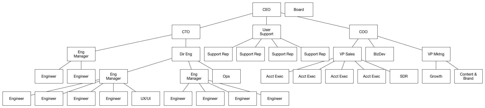

Many organizations have an org chart that looks something like this:

At the top is the CEO and the board.  Below that are the other C-level executives, then the VPs and Directors, and at the bottom, the individual contributors.

People draw charts like this because it feels satisfying to put the people with more power higher up.  It gives us all a warm feeling of safety to know that the people at the &ldquo;top&rdquo; have a clear view of the terrain, and are steering the ship in the best direction possible.

It&rsquo;s clear, when looking at a chart like this, that being higher &ldquo;up&rdquo; the chart is better.  The best engineer becomes the king of their team, and then the best team-king becomes the King of Engineering (aka CTO).

I think a better metaphor is something like this:

Leadership sits in the middle.  They don&rsquo;t have a &ldquo;high level view&rdquo;. In fact, their view of reality is the <em>worst</em> of anyone.  They do have the best view of the interactions between the teams, and the highest degree of access to confidential information internal to the organization.  They maintain the culture and facilitate the inter-team activities.

(Note that the board is locked in the center with the CEO, but without even a connection to anything else.)

Individual contributors in any given team have extremely detailed, timely, and accurate information about their section of reality. Engineers know the reality of what the software can do.  Sales and support know what customers are asking for.  However, they tend to have little insight into what things look like on the other side of the org.  When they turn around and look back in at the org, they see their manager, and maybe a few interactions in neighboring teams. They necessarily rely on the management infrastructure to inform them about the broader organization.

A healthy organization moves from its center, and responds to input from its edges.  This requires two extremely important communication flows:

<ol><li>Intent flows out.</li>
<li>Reality flows in.</li>
</ol>
When in a leadership position, people will follow you.  They can&rsquo;t help it.  It&rsquo;s how we&rsquo;re wired.  This is very dangerous.

When a leader starts telling their organization what to do, this destroys intent-based leadership.  If the leader is wrong about the facts on the ground (which <em>of course</em> they often will be, since they can&rsquo;t see it!), then this will lead to two types of disasters:

<ol><li>My leader is foolish, and I am enlightened (losing faith in the organization)</li>
<li>My leader is enlightened, and I am foolish (losing faith in oneself)</li>
</ol>
Both of these are disasters because they break the &ldquo;intent out, reality in&rdquo; model.  People at the edges will stop sharing their experience if they stop trusting it, because they don&rsquo;t want to let on that they don&rsquo;t know what they&rsquo;re doing.  If they stop trusting the organization as a whole, then it&rsquo;s only a matter of time before they&rsquo;re out, and in the meantime, they&rsquo;re not going to be working at full potential.

Intent-based leadership is like muscle memory.  If your neocortex had to direct every single body part individually, you&rsquo;d never be able to talk or walk, let alone ride a bike or drive a car.  Instead, your neocortex says &ldquo;I want a snack.  Go to the kitchen.&rdquo; and a bunch of sub-systems handle the various sub-tasks more or less on their own.

This requires a high degree of trust and practice.  Practice leads to competence, and competence over time builds trust.  When trust is lost, the information flows get blocked.  This leads to an increasing failure rate, blame games start, and it gets harder and harder to regain footing.

<em>(Of course, in reality, organizations don&rsquo;t exist in 2-dimensional space, and lateral communication is extremely important.  But avoiding balkanization is a subject for another day.  The goal of this post is to make a point about leadership and hierarchy.)</em>

The best book I&rsquo;ve found about intent-based leadership is <a href="http://smile.amazon.com/gp/product/1591846404">Turn The Ship Around</a> by <a href="https://twitter.com/ldavidmarquet">David Marquet</a>.  I highly recommend it.

