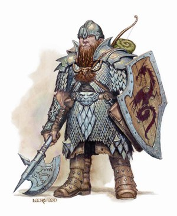
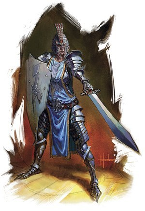
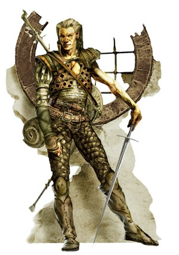
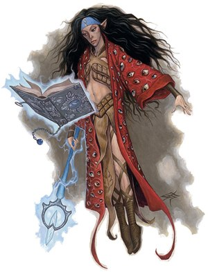
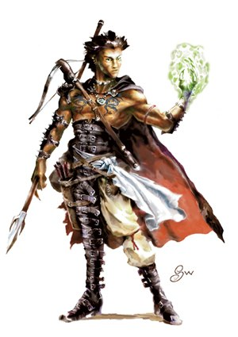

I&rsquo;ve read <a href="http://www.amazon.com/dp/0201835959/?tag=isaacschlcom-20">The Mythical Man-Month</a> lately (at <a href="http://foohack.com/2007/10/required-reading-for-web-developers-the-fountainhead-by-ayn-rand/#comment-132">Geoff&rsquo;s suggestion</a>, among others) and it&rsquo;s great.  I definitely recommend it highly to anyone in the software development field.

In particular, I was struck by the idea of Mills and Brooks that software development could be done more effectively by a &ldquo;surgical team.&rdquo;  That is, the experienced lead developer writes all or most of the code, and is supported by a team of people to make him more effective.  While this is perhaps an effective way to capitalize on the significant difference between excellence and mediocrity in coders, it seems to me that most of the jobs on the team are today either (a) made obsolete by technological advancements, or (b) best done by specialists who float between teams.  For example, Yahoo! has some of the best Javascript and CSS &ldquo;language lawyers&rdquo; in the world&mdash;but does every team really need one?  The need for a full-time toolsmith has been all but completely surpassed by the customizability of workstations and the availability of many high-quality tools for coding and such.

The nature of software development has changed somewhat as well.  We aren&rsquo;t writing assembly code any more; not only do we have high-level languages, in my current project, there are no fewer than 9 different languages in use, 10 if you count regular expressions, which we all use quite frequently.  <a href="#ft1" id="n1" title="MySQL, PHP, Javascript, HTML, CSS, Bash, Perl, XML, yinst, regular expressions. Actually, 11 if you count Apache config directives.">[1]</a>  We aren&rsquo;t all creating the same kind of stuff.  Thus, there is a strong need for <em>all</em> of us to be experts, surgeons if you will, in our respective areas.  In addition, the non-coding jobs require their own sort of specialized focus.

It occurred to me that this division of labor, where everyone depends on everyone else but everyone has a very different job, is more like a Dungeons and Dragons party than a surgical team.  Each member plays a vital but remarkably different role, each owns what they do, and each is the team&rsquo;s expert in what they do.  As a webdev, I get consulted about front-end concerns, and am quick to ask a back-end engineer about things that touch their domain.  UI questions are decided by the interaction designer; questions of product features are handled by the product manager, etc.  I suspect that this is not unique to software for the web; a similar metaphor exists (or at least, <em>could</em> exist) for application software.

The best D&amp;D parties are a bit formulaic, but that&rsquo;s simply because a certain distribution of talents tends to be most adaptable to the most different kinds of problems.

<h3>Fighter</h3>

 Not the flashiest or most prestigious role, Fighters have the lowest barrier to entry.  They accumulate experience quickly, and don&rsquo;t have a lot of class bonuses.  (Until 3rd Edition made them into action heroes, that is.)  But their simplicity belies a focus and strength that is crucial.  The fighter is the guy in the party that protects the more &ldquo;thinky&rdquo; types from anything that might get in their way.  There can be honor and satisfaction in bashing orcs one at a time.

On a web development team, there are two archetypes that sometimes satisfy this role.  The first is the diligent code monkey who might not be the most ambitious or inventive, but is good at getting things done.  They are perfectly happy to churn through buglists, knocking down whatever they can.  If you show them how to do something, they&rsquo;ll make it work however it has to through sheer force of will&mdash;not always fast or elegant, but functional.  When depended upon properly, code monkeys are a great and valuable asset.

Also in the fighter category are the producers who manage the content of the site, use the admin tools, troll for spammers, and do all the other busywork of web site maintenance.  When the programmers have moved on to the next problem, they&rsquo;re still working.  Don&rsquo;t forget them.  Whenever possible, make their lives easier.  They are the ones that keep your product shiny, so you can continue to be proud to have the URL sitting there on your resume.

<h3>Ranger</h3>

Rangers are good at surviving on their own.  They shun convention and human society.  Often a bit wild themselves, they feel more comfortable in the company of nature.  Their chaotic bent can sometimes be a liability in an adventuring party, but their wide-ranging knowledge makes them hard to discount.  They are fiercely independent and difficult (if not impossible) to tame.

In a programming team, this is the quintessential hacker.  Most mashups are created by a single ranger acting alone.  They are great at creating new things, and no browser quirk or network irregularity will stand in their way.  On the other hand, they don&rsquo;t always follow convention, and have a tendency to create overly clever code that is unintelligible to anyone who follows in their wake.  Thus, they have to be watched closely lest they venture off.

I&rsquo;ve learned a lot of great tricks and techniques from the Ranger programmers I know.  I&rsquo;m always a bit envious of their free approach to things, but I guess I&rsquo;m just too timid to abandon convention completely.  Make sure that you understand their code before you try to adapt it to your own ends&mdash;wild animals turn vicious when handled improperly.

<h3>Paladin</h3>

 The paladin is the character class with the most stringent requirements.  They must conform to the strictest of moral codes and demanding attribute requirements.  As such, they&rsquo;re rare, and respected.  The paladin&rsquo;s job is twofold.  As a warrior subclass, he protects the party members from outside threats.  However, he&rsquo;s also a healer, and a leader.  Charismatic and compassionate, he holds the party together by negotiating internal conflicts.  Unshakably positive, he nonetheless keeps everyone going with firm conviction in the mission.

The best project managers aspire to paladin-like grace in their roles.  They defend the team from the pressures of management and the monotony of GANT and PERT charts, and make sure that everyone is able to work at their top potential.  When there&rsquo;s a problem, they are approachable and always seek a win-win situation.  By being consistently honest and righteous, they earn the respect and admiration of those both below and above them on the management totem pole.

When someone leads like a paladin, you <em>want</em> to get your tasks done and meet your deadlines.  Not because you&rsquo;re afraid of the consequences, but simply because their drive and attitude are contagious.

There are some managers that are decidedly un-paladin-like.  Few things are as hazardous on a project as leadership that does not inspire confidence and commitment.  Attitude is everything in a leader.

<h3>Rogue</h3>

 The rogue is a highly adaptable character.  They can pick locks and disarm traps, making them essential in any dungeon-faring party.  Surviving in the streets and cities on his wit and stealth, a rogue comes to know the different factions and groups, and learns to navigate the urban waters.  He knows how to make a buck, how to make a friend, and how to sell, and where to buy.

The product manager takes on this role for a programming team.  They are often the ones who first envision the product and pitch it to management.  Often the only member of a programming team with a business background <a href="#ft2" id="n2" title="Unless the webdev is a business school drop-out, that is.">[2]</a>, they settle questions of business goals and product requirements.  They make the powerpoint presentations that eventually drive the development of a real software product.

The product manager, like a rogue, also sings the song of the party, talking them up when necessary and interacting with foreign powers <a id="n3" href="#ft3" title="Some teams, of course, have a dedicated business development person, or &quot;BizDev&quot; who handles outside relationships so that the product manager can focus on product development. I realize that I'm blurring the distinction, but I don't think it's a big deal.">[3]</a>.  If a product requires buy-in from another team, whether it&rsquo;s a standards group in the same company or a potential outside partner, these are the people who make the calls and settle the deal.  Their day is usually full of meetings.

I&rsquo;ve known some developers who look down on product managers as being less technical.  This is a big mistake.  Their job is every bit as intellectually rigorous as ours, due to the huge amount of information that they need to be able to call forth on demand.  Since they deal with features and requirements that have not even been fully envisioned, and might not exist in any form whatsoever in the market, they are even more in the world of pure thought-stuff than programmers.  Make friends with your product manager, and you&rsquo;ll find that they often do actually know their stuff.  And after all, some rogues will stab you in the back if you cross them ;)

<h3>Mage</h3>

The mage is the general purpose wizard.  They are resourceful and possess a broad understanding of all types of magic.  While not specialized in their studies, they are deeply theoretical, research oriented, and possess incredible focus and discipline.  Their power comes from being able to summon a wide variety of spells, but they tend to be weak and vulnerable in the chaos of melee, since they must prepare spells ahead of time.

Many experienced back-end engineers fit into this role.  They tend to prefer structured approaches and strongly typed languages, and produce exceptionally high-quality code.  They often have advanced degrees in computer science and are knowledgeable in the intricacies of design patterns and memory management.  They excel in areas that are somewhat regular and predictable, where the environment can be controlled, and the assumptions and edge-cases checked accurately.

Dedicated programming wizards are obviously important on any programming team.  However, as much as &ldquo;laymen&rdquo; tend to see all software as a form of magic, the truth is that mages are actually pretty rare in the development world.  They are the core of the &ldquo;20%&rdquo; of developers who truly care about what they create and diligently work to improve their abilities.  Their craft is important to them, and they approach each problem with care and precision.  It is much more than just a way to pay the bills.

While dedication is important, it comes at a price.  Many back-end engineers come to get out of touch with the way that &ldquo;normal&rdquo; people think and interact with software.  Most are pretty aware of this fact; I once knew an engineer who complained that bugzilla&rsquo;s user interface was <q>obviously designed by a database expert</q>.

<h3>Specialist Wizard (illusionist, abjurer, conjurer, etc.)</h3>

 These are the wizards that have selected a certain area of magic in which to specialize, at the expense of reduced ability in some other area.  They have the same theoretical focus as a mage, but instead of having a broad understanding of every type of magic, they work to gain a much deeper understanding of a single area.  When it comes to solving that sort of problem, they are the best&mdash;however, in other areas, they may be lacking.

There are many &ldquo;specialist wizards&rdquo; in the programming world.  Here at Yahoo!, there are teams that focus 100% of their time on developing PHP, or MySQL, or Apache.  (<a href="http://lerdorf.com">Rasmus</a> comes to mind.)  The &ldquo;Paranoids&rdquo; team sits in the cubes adjacent to ours, and they work to make sure that all the software at Yahoo! is as bulletproof as possible.  The exceptional performance team does research to help us webdevs make our pages load and run faster.

When you have a hammer, the world can begins to look like a nail.  A MySQL specialist will be tempted to suggest a database schema to solve any problem, even perhaps if the problem would be better solved by some other method.  You may be asking for trouble if you ask them to do something outside their specialization.  However, if you have a certain task that you&rsquo;re certain to need, they can be invaluable.  Database optimization is a highly developed science, and it&rsquo;s not always easy or simple.  Good programmers are rarely security experts (or even security knowledgeable!)

If you aren&rsquo;t likely to have a lot of problems in their specialty, it&rsquo;s often better to consult with a specialist only if and when they&rsquo;re necessary.  That way a single specialist can service multiple different teams.

<h3>Sorcerer</h3>

Sorcerers are similar to mages in the types of spells that they can cast, but instead of preparing spells from a spellbook, they simply select from the spells that they know, calling them when needed.  As such, they tend to be much more spontaneous.  However, they do not cultivate the discipline or depth of understanding of the wizards, and so they are limited in the number of spells that they can learn.  The sorcerer excels in areas that are uncharted, and their spontaneous approach to magic allows them to quickly adapt to any situation, no matter how unpredictable.

The sorcerer is the perfect corollary to the webdev, <abbr title="also known as">aka</abbr> the front-end engineer.  Web browsers are a constantly moving target, with each behaving a little differently and new versions being released all the time.  While programming patterns and the &ldquo;right&rdquo; ways of doing things can be useful, they are often too bulky for Javascript that has to be delivered, parsed, and executed on demand.  Essentially, the webdev creates software in an environment where the rules often make no sense; where the code has to work on different platforms with conflicting requirements; where speed and features are both must-haves.

I&rsquo;ve only recently heard of any colleges that make any serious attempt to teach courses on web development.  From what I have heard, the things they teach are pretty bad&mdash;at best out of date, at worst outright harmful.  Most professional web developers that I&rsquo;ve met didn&rsquo;t learn their craft in school.  Like the sorcerer, they simply picked up their craft as they could, and learned techniques by studying &ldquo;in the wild&rdquo;; that is, by viewing source and reading websites and trying things out.

I&rsquo;ve said before, it takes a certain kind of crazy to want to write software in the browser.  You have to love the chaos and enjoy pulling out tricks and coming up with new hacks to work around impossibly ridiculous requirements.  At the same time, unlike the ranger&rsquo;s free-wheeling wildness, the team&rsquo;s sorcerer must have enough discipline to tame the chaos and create software with whatever degree of stability he can, in order to help create a functional and stable site.

It can be a challenge at times to find stability and see the bigger picture and not write code for a single case.  Yes, yes, that hack made it work in Safari.  Lovely.  But it&rsquo;s also going to be a nightmare to maintain, or you just ruined the accessibility.  Trade-offs are always present, and as far as I can tell, only experience and a lot of mistakes can teach you how to choose wisely.

<h3>Cleric</h3>

Diligent and committed to the ethos of their higher power, the cleric summons heavenly forces to do his bidding.  By making himself an instrument of the divine, he can accomplish great things.  A cleric&rsquo;s power comes from their will and common sense (in D&amp;D, this is the Wisdom score), as opposed to the cleverness and wit that Wizards rely on.  The cleric has the power to vanquish undead through the force of their convictions, and their healing spells make them a must-have for any party.

 In a programming party, this is the role of the <abbr title="Quality Assurance">QA</abbr> tech.  These noble souls must possess tenacity and diligence far beyond what is normal or sane.  They must have the conviction and tenacity to insist that every test case be faithfully executed, even if it&rsquo;s &ldquo;impossible&rdquo; that this-or-that change would have caused a regression.  When they see something in the product that doesn&rsquo;t look right, they must get to the bottom of it, carefully catalog the event, and enter it into the bug queue.  They help banish the skeletons by exposing them to the light, no matter where they may try to hide.

Many a programmer, close to a deadline, has remarked with exasperation, <q>Jeez, %$!@# QA keeps making me revisit this thing, I fixed that already!</q>, only to find, when they go through the steps in the bug report, that yes, it <em>is</em> indeed broken.

While they may seem difficult or inefficient or outright stubborn at times, they&rsquo;re vital.  Their wisdom is a balance to the programmers&rsquo;
<noscript>Certaines se réfèrent à des <a href="http://www.glavaflex.com/casino-gratuit-liste.html">casino gratuit</a> qui ne jette pas frappé le mur opposé comme &ldquo;Mellenberg Rolls.</noscript> wit, and they keep teams from burning up.  Budget plenty of time for QA.  Start it early.  Get someone who knows what they&rsquo;re doing, and use a proper bug tracking system.  Your customers won&rsquo;t thank you for it, but they&rsquo;ll certainly come to hate you if you don&rsquo;t.

<h3>Druid</h3>

Free from any affiliations or alignment, the druid transcends the simple human existence to become one with the natural world.  Unlike the clerics who request their power from a deity, the druid opens themselves up to be nature&rsquo;s instrument.  It is an understatement to say that they know about the wild world; they understand the ways of the animals and plants intuitively and instinctively.  Always seeking the way of balance and harmony and simplicity, they do not try to change or restrict the chaos of nature, nor do they rebel against the order that sometimes comes out of that chaos.

 Designers are called by many names in our industry.  <abbr title="User Experience Designer">UED</abbr>s, Visual Designers, User Interface Architects, <abbr title="Human Computer Interface">HCI</abbr> Specialists, Interaction Designers, <abbr title="Information Architect">IA</abbr>s.  (Indeed, these roles are somewhat different, as the task of designing the user interface has many facets.)  Whatever they&rsquo;re called, their job is to understand the expectations and habits of people they&rsquo;ve never met, and shape the product into something that will fit the user&rsquo;s mental model.  At the same time, they must understand how those models change in the face of new problems and new solutions, and be able to adapt their software properly.

Like the druid, the UED must be free from any biases that may impede their ability to find the best solution for the user, even if that sometimes means that they may take issue with business objectives.  (If the business goals and the user goals cannot both be met, then the product is in real trouble, anyhow!)

Part of the UED&rsquo;s task is to map out the competition&rsquo;s sites, to determine where this new product fits into the current ecosystem and how the target market&rsquo;s expectations may have already been set.  They must sometimes balance the &quot;ideal&rdquo; way of doing something with the &ldquo;common&rdquo; way of doing it, simply because users have been trained in a certain way.

<h3>More Similarities</h3>

A lot of the same characteristics that make up a good party are also true of a good programming team.

<ol><li>A team should have enough members to get the job done, and no more.</li>
    <li>Each member should know his role, and enjoy doing it</li>
    <li>Balance is key.  Each part of the task should be accounted for, and no one area should have more resources than is needed</li>
    <li>Druids make so-so healers; UEDs are usually pretty good at QA.  A really good sorcerer might be able to handle the magic support if it&rsquo;s not too intensive; most webdevs can usually throw some kind of back-end support together.  But, if a certain area of the project is significant, then it&rsquo;s worth having someone who knows it best.</li>
    <li>Multiclassing can make a character more diverse, but they won&rsquo;t increase in levels as quickly.</li>
    <li>Treasure should be distributed fairly.</li>
    <li>If you have more than one mage (or sorcerer, or cleric, or druid, or whatever), they should either divide responsibilities or one should be in charge.  Same for the roles on a programming team.</li>
    <li>It&rsquo;s hard for a fighter to know how good a wizard is, or vice versa.  It takes one to know one.  Make sure your team helps interview new hires.</li>
    <li>Raising levels and carefully assigning skill points will lead to a more powerful character.  We <a href="http://en.wikipedia.org/wiki/Min-maxing">min-max</a> in real life, which is why we do it in RPGs.</li>
</ol>
Like most of the essays in <a href="http://www.amazon.com/dp/0201835959/?tag=isaacschlcom-20">The Mythical Man-Month</a>, the fundamental principles of the surgical team are valid, even if the specific roles are mostly out of date.  Within each class on the adventuring party, you can sometimes see a combination of surgeon and co-pilot; sometimes the co-pilot is unnecessary, or there are two surgeons who divide up the work.

The basic idea of thinking about the programming organization in a creative way is also worthwhile, even if only as a mental exercise.  I&rsquo;m sure that there are other metaphors that would work equally well.

In general, I think that the motley crew of adventurers is a lot more fun than the surgical team.

<h3>Disclaimer</h3>

All images copyright © 2007 Wizards of the Coast.  Please don&rsquo;t sue me, WotC!  We love you!

I&rsquo;ve taken some liberties with the images used.  The Rogue is actually a Bard.  The Specialist Wizard is some kind of psionicist.  The Ranger is actually a Scout.  I picked more for style than accuracy.

<h3>Footnotes</h3>

<a href="#n1" id="ft1">[1]</a> MySQL, PHP, Javascript, HTML, CSS, Bash, Perl, XML, yinst, regular expressions. Actually, 11 if you count Apache config directives.
<a href="#n2" id="ft2">[2]</a> Unless the webdev is a business school drop-out, that is.
<a href="#n3" id="ft3">[3]</a> Some teams, of course, have a dedicated business development person, or &ldquo;BizDev&rdquo; who handles outside relationships so that the product manager can focus on product development. I realize that I&rsquo;m blurring the distinction, but I don&rsquo;t think it&rsquo;s a big deal.

