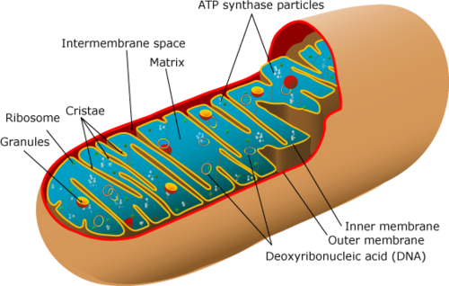

Here&rsquo;s a freaky thought:

Mitochondria.

Think about that shit.

It&rsquo;s got its own DNA.  It&rsquo;s like a completely separate bunch of organisms living inside all your cells.

Way back in the pre-cambrian, some single-celled ancestor of ours swallowed some other single-celled thing, and was like, &ldquo;I&rsquo;m keeping it as a pet!&rdquo;

And now we have this little bacteria-type thingie living inside each of our cells.

Say hi to your cells&rsquo; pet: 

