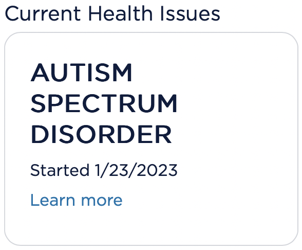

How to get an autism diagnosis <a id="re-self-dx-1" name="re-self-dx-1" href="#re-self-dx-fn-1">1</a>

- Be me.
- Get misdiagnosed as ADHD at age 10.
- Get prescribed Ritalin, lose all semblance of sleep order and
  circadian rhythm.
- Revolt and stop taking the drugs at age 14.
- Learn about autism at age 27. "Wait, isn't that just like,
  normal, though?"
- Learn that everyone isn't normal like me. Most people are
  different!
- Study autism for 10 years. Become somewhat convinced that it
  might apply. Would explain the multitude of sensory issues,
  social/emotional difficulties, overwhelm, burnout, meltdowns.
- Discuss with therapist, he agrees.
- Continue studying for 5 more years. Still not 100% sure, but
  seems likely.
- Learn that <abbr title="hypermobile Ehlers Danlos
  Syndrome">hEDS<abbr> and autism are highly comorbid, explains
  the hypermobility, soft stretchy skin, and <abbr
  title="Positional Orthostatic Tachycardia Syndrome">POTS<abbr>.
- Learn that GI and skin issues are highly comorbid with autism,
  explains the psoriasis and the butt stuff.
- Almost sure now.
- Learn that Low Dose Naltrexone can reduce the intensity of
  sensory hypersensitivity due to ASD.
- Write an email to my doctor: _"As you know, I'm autistic. I have
  learned of these studies showing that LDN can help reduce the
  intensity of sensory hypersensitivity."_ Doc says, _"Sure it's
  safe, but talk to psych anyway."_
- Psych meets with me for 30 minutes and asks several questions
  pulled from the DSM-5 criteria for BPD, bipolar, ADHD, ASD, few
  other things.

### 15 YEARS OF INDEPENDENT RESEARCH to get "self diagnosed", and ONE (1) 30-MINUTE CONVERSATION to get "officially" diagnosed. THAT'S RIGHT, IT'S DOCTOR APPROVED NOW, SO Y'ALL ELITIST ANTI-SELF-DX ASSHATS CAN EAT AN ENTIRE BAG OF DICKS!

I was misdiagnosed as ADHD when I was a kid. That was just
clearly wrong, extremely obvious at the time to anyone who'd
taken the time to actually look at the diagnostic criteria and
look at me, and the drugs did *actual* harm to me. And *I*
figured this out, myself, 4 years after being diagnosed at age 10
by a medical professional, and I was a fucking child of 14 years
old at the time.

Unlike that official diagnosis of ADHD that I got at age 10, an
incorrect *self* diagnosis has never harmed anyone.

Doctors are less invested in our health than we are, less
motivated to educate themselves about the most recent findings in
the research, and they don't actually suffer the consequences of
getting it wrong. Self diagnosis isn't just "also valid", it's in
many cases and for many purposes far *more* valid than an
official screening.

No one's self diagnosis is "stealing resources" or causing autism
to be taken less seriously. Autism *isn't* taken seriously, never
has been, so this concern is tragically absurd. Autistic adults
know full well that we need to be screened by a professional in
order to qualify for any treatment or other serious
accommodations. But doing the work of self diagnosis *ahead of*
an official screening by a psychotherapist or psychiatrist is
unfortunately a critical step if you want to avoid being
harmfully misdiagnosed and potentially subjected to drugs and
treatment that are unhelpful or even profoundly harmful.

Self diagnosis never once made me "feel special". I don't feel
special to be autistic. In fact, I felt a lot *more* "special"
when I thought all my stereotypically autistic traits were
entirely unique to me! Autism has shown me that I'm an extremely
average example of a pretty big community. There are other people
just like me! That's fun. That's very special. It's allowed me
to find community and acceptance. It allowed me to be *less*
special, to be *normal*. Which, honestly, is really nice.

Everyone who decides to get an official autism screening with a
mental health professional must have at some point come to the
conclusion for themselves that they are likely autistic, or else
why bother? So self diagnosis is often actually a component and
*requirement* of an official diagnosis.

If you are against self diagnosis, I'm going to assume you are
ignorant and just hate autistic people (and likely, all disabled
adults) until proven otherwise.

<small>
1: Not the only way to get one, of course. <a href="#re-self-dx-1" name="re-self-dx-fn-1" id="re-self-dx-fn-1">back</a>
</small>
