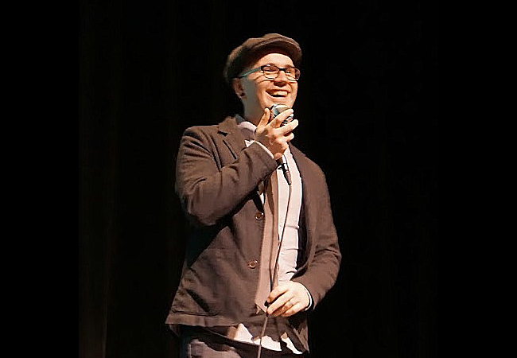
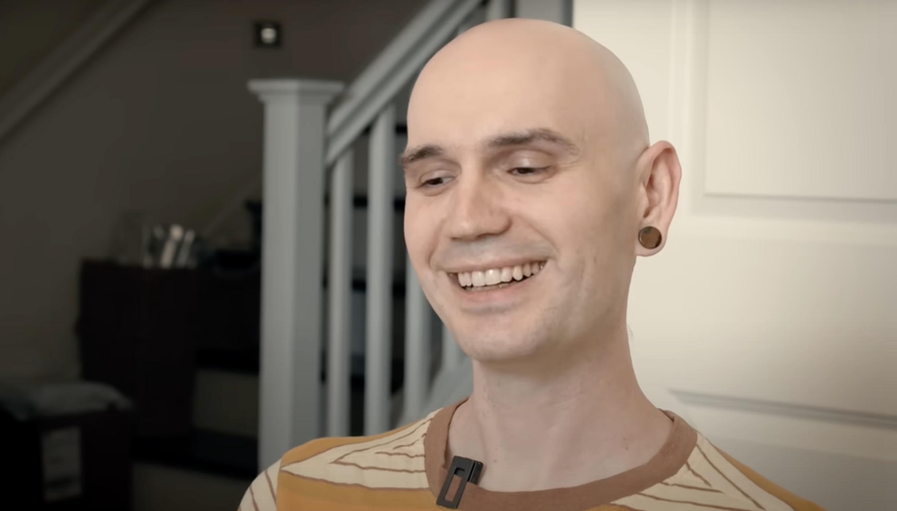

[Mikeal Rogers](https://github.com/mikeal) died on the morning of
Monday, 2025-06-09, after enduring 7 months of treatment for
aggressive colorectal cancer.

I'm so inescapably sad.

Last year, Mikeal set up [a git
repository](https://github.com/mikeal/cancer-diaries) and had
asked people to share memories, ways in which they've been
impacted positively.

This is [what I
wrote](https://github.com/mikeal/cancer-diaries/blob/main/best-memories/2024-11-24-just-everything-for-the-last-15-years.md).

> ## Just Everything Over The Last 15 Years
>
> Fuck.
>
> Where even to begin. I suppose I'll begin at the beginning, at
> least the beginning of us. I went to a server-side JavaScript
> meetup in 2009, when Node was just a newcomer in the SSJS
> space, one of many upstart projects.
>
> I was giving a talk on JSGI, and how it might be a standard
> that server-side JavaScript platforms could coalesce around.
> But really, I was already of the opinion that Node was really
> The Thing.
>
> Some guy I'd never met heckled me, saying we should skip all
> that JSGI portability noise and just work on Node exclusively.
> He wasn't wrong, in fact that was the point I sort of secretly
> was trying to guide the community towards, so it put me in a
> weird position of agreeing with my harasser.
>
> Afterwards, he said, "Yeah, you're isaacs. I know you from the
> node irc. I'm Mikeal, spelled funny." That's when I learned how
> to pronounce your name.
>
> Some time later, you invited me to Oakland for lunch at the
> Couch.IO offices. I had taken a sabbatical to work on npm, and
> was trying to figure out how best to create a registry for it.
> You threw together a proof of concept that is still (despite
> all of our better judgement) the de facto standard for the
> interface defining how JavaScript packages are published and
> consumed.
>
> That visit is what convinced me that I ought to move from
> Mountain View to Oakland, the city that has become my first
> permanent adult home. I haven't left since.
>
> In all this time, from those very first interactions, up until
> now, you've been one of my best and favorite friends. A
> recounting of all of the best memories would just be a history
> of each stage of life over the last 15 years. We've biked all
> over this town drinking coffee and writing code. We've shared
> meals, we've discussed life and philosophy and spirituality
> over whiskey and then when we got older, soberly while our kids
> played. We've changed the tech world together, multiple times.
> We've been to conferences together and traveled the world. We
> made sourdough bread a meme within JavaScript, long before it
> became associated with covid lockdowns.
>
> I love deeply, but I don't make friends easily. Chalk it up to
> the autism, I guess. I've always had unshakable respect for
> you. You are one of the only people whose opinion I've always
> cared about, one of the brilliant few who I've looked up to and
> wanted to impress.
>
> On November 9, we went to the park so our kids could play
> together.
>
> When I asked if it was ok if I invited Emily, you said sure,
> but you asked me to come early. You said "I just need to have a
> conversation with someone who isn't my family."
>
> I completely understood. And also, I must admit, I was
> flattered beyond words to have been the person you reached out
> to. I am always utterly blown away at how much you seem to
> value me, in your way of just casually treating it as obvious
> that I'm important to you.
>
> You told me about some difficulties you'd been having. I said
> I'd ask if my therapist was taking on new clients, because I
> thought he'd be a good fit.
>
> Emily arrived, and she brought Max, who did some toddler
> parallel play with Kai. Juniper and Kora ran around inventing
> games together, as kids their age do. You ordered a pizza from
> Round Table, and I went and picked it up.
>
> You left early because you weren't feeling well. Later you
> said, "I don't think that pizza agreed with me."
>
> I don't think it was the pizza at all. I think it was the
> cancer.
>
> We made plans to get breakfast on Thursday the next week. On
> Tuesday, you texted me, "I’m not gonna make it, I’ve got cancer
> that has spread to multiple organs."
>
> (I clarified that "not gonna make it" was referring to our
> breakfast plans, not like, life. But also... hm.)
>
> I'm trying real hard to stick to the assignment here, make this
> about memories instead of grief or my own feelings. But for
> fucks' sake, how is that even possible? I will miss you more
> than anyone can imagine. You are my closest friend, and losing
> you feels so deeply unfair. I know I'm nowhere near the front
> of that line, not that it's a competition, but like, Kora's
> losing a dad, Anna a husband, etc.
>
> But that doesn't change anything. A greater loss never made
> another loss lesser. To the extent that anyone has known you,
> they love you, and you and I have known each other well.

Mikeal and I texted back and forth a bit during his treatment.
Mostly, me sending him things, because summoning the energy to
compose a reply was so hard for him by the end.

He said several times that he was looking forward to getting a
meal together again, a nod to those plans abruptly canceled. Just
once the chemo isn't quite so intense. Once he can catch his
breath. Soon.

But it turns out "not gonna make it" was simply the whole truth.
None of us make it, in the end. Death is simultaneously too grand
and cosmic to begin to contemplate, and too petty and pedestrian
to bother commenting on.

"Just everything over the last 15 years" is exactly what I shared
with Mikeal, as our lives developed and priorities shifted. He
and Anna were the first visitors to Marisa's and my first
apartment in Oakland. We went to each other's weddings. Our
conversations stretched over the years and 5 continents. Our kids
grew together and played together. We made time to visit in
between everything else going on, talking each other's ears off
about whatever special interest had our attention at the moment.
From the day we met, it was obvious we'd be friends.

I visited Mikeal on Sunday afternoon, the day before he passed.

He couldn't talk, and was very visibly affected by an
appropriately large amount of pain medication. I told him what an
impact he'd made on my life, and how important our friendship had
been to me, that I would not have been able to do as much in my
life if not for his influence. He nodded and gasped a bit,
attempting to say something perhaps. I hope he understood. But of
course no one can know, and it wouldn't matter now anyway.

There's just nothing for this loss. It sucks so much.

